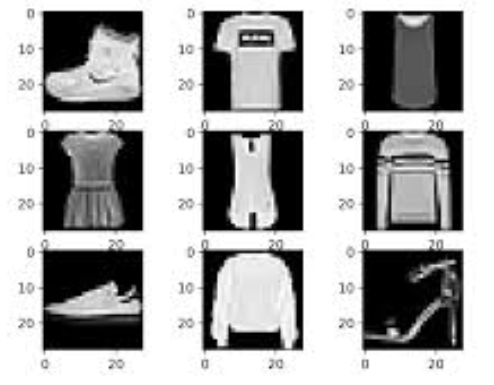
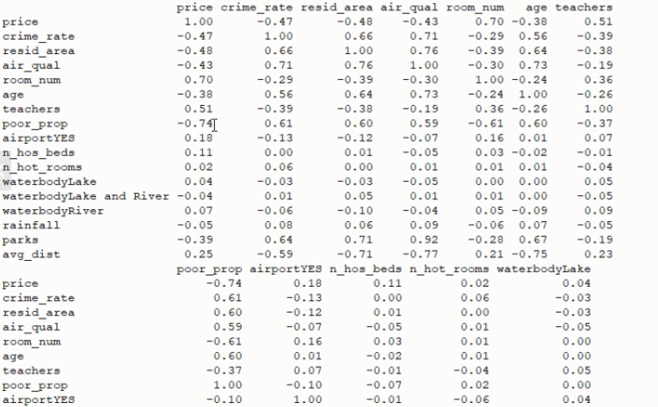
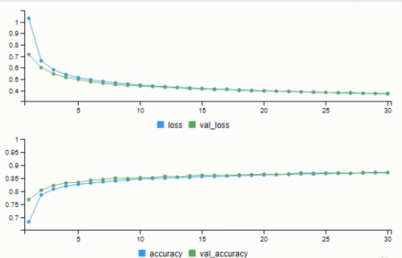
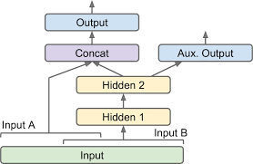
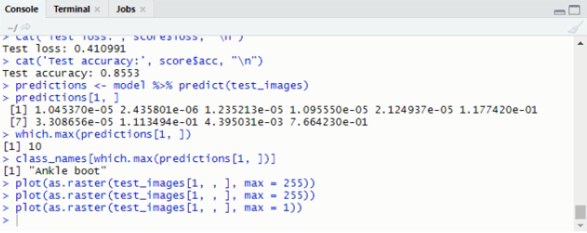
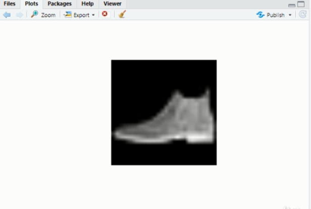

# Modelling in ANN

Deep Learning is the most exciting and powerful branch of `Machine Learning`. It's a technique that teaches computers to do what comes naturally to humans: learn by example. Deep learning is a key technology behind many of the technologies we are using today.

Goal is to provide an efficient system that can recoginize the correct type of cloth from a set of data containing numerous values.

## 🔨  Basic Working 

We took one of the most famous datasets, i.e., Fashion Mnist and on this dataset we splitted the data into train and test data.
After making the proper installations data is plotted so that the structure can be analysed which is then led by normalizing the data.

Flattening of dataset is done in order to convert 3D matrix in 2D after which the model is optimized using SGD(Stochastic Gradient Descent) optimizer. Performance is tested in order to seize best possible parameters. Based on the difference between the actual value and the predicted value, an error value also called Cost Function is computed and sent back through the system.

The model would be presented in somewhat similar way as the diagram below:

- Dataset Display

### Hyperparameters' Tuning

Flexibility of ANN includes some drawbacks like:

- Number of layers
- Learning Rate
- Number of neurons per layer
- Weight initilization
- Type of activation function

- Parameter displaying diagram

For parameter efficiency we use more  than one hidden layer 

- Learning Rate: Half of maximum learning rate. 
- Batch Size: Should be less than 32 and don't make too small (More than 20)
- Epochs: Use early stopping otherwise learning rate will diverge and overfitting happens.

### Training ANN with Stochastic Gradient Descent

- Step-1 Randomly initialize the weights to small numbers close to 0 but not 0.
- Step-2 Input the first observation of your dataset in the input layer, each feature in one node.
- Step-3 Forward-Propagation: From left to right, the neurons are activated in a way that the impact of each neuron's activation is limited by the weights.   Propagate the activations until getting the predicted value.
- Step-4 Compare the predicted result to the actual result and measure the generated error(Cost function).
- Step-5 Back-Propagation: from right to left, the error is backpropagated. Update the weights according to how much they are responsible for the error. The learning rate decides how much we update weights.
- Step-6 Repeat step-1 to 5 and update the weights after each observation(Reinforcement Learning)
- Step-7 When the whole training set passed through the ANN, that makes and epoch. Redo more epochs.

The analysis shows the loss and accuracy of our predictions with test set. This is required in order to know the changes that should be made for enhancing the efficiency of system.

- Analysis Diagram

### API

An application programming interface is a computing interface which defines interactions between multiple software intermediaries. It defines the kinds of calls or requests that can be made, how to make them, the data formats that should be used. There are two ways in which we can define our model on keras.

- Sequential API: normal neural network with linear stack of layers, hence mostly used when we have `Classification type model`.
- Functional API: complex neural network structure where we have multiple usage of several small networks, because of which in this case we mostly have Regression type models.

- Functional Api 

- Saving and Restoring Models  

If we want to save data of our model, it can be saved in different file and then can be restored. That can be done by using the extension `hdf5` or `hd5`.

### Testing 

Here we have given an example of how the model we created is predicting a value we gave as test. In `TestConsole` an anonymous value is provided and our model shows the result as Shoes which can be viewed in `outputConsole`.

## Dependencies

- Keras library
- RStudio
- NumPy
- Scikit-learn

## 📦 Install

Open the code `ANN_2.R` in Rstudio after downloading both RStudio and RStudio for windows simply run it. Before this save the inbuilt dataset in a `Keras` so that you can fetch it by putting the location of saved file in the code.
It is to be mentioned that tensorflow libraray should in installed in RStudio. `Miniconda` can be downloaded alternatively.
 
Similarly fetch the files for keras and regression model and run the code line by line by pressing `Ctrl+Enter`.
